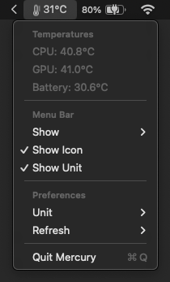

<h1 align="center">Mercury</h1>
<p align="center">A tiny temperature monitor that lives in your menu bar.</p>
  
<p align="center">
  
  
  
</p>

<br />

<p align="center">
  
</p>

## About

Mercury reads temperatures directly from your Mac's SMC (System Management Controller) and displays them in the menu bar. No background daemons, no Electron, no web views. Just a native SwiftUI app under 200KB.

- **Native** - Built with SwiftUI and IOKit. Nothing else.
- **Fast** - Direct SMC reads. Sub-millisecond sensor polling.
- **Light** - <1% CPU at default refresh rate. No network calls.
- **Minimal** - One menu bar item. No dock icon. No windows.

## Features

- CPU, GPU, and Battery temperature monitoring
- Dynamic menu bar icon (low / medium / high)
- Celsius and Fahrenheit
- Configurable refresh interval (1~10s)
- Auto-detects available sensors per chip
- Supports Apple Silicon (M1~M5) and Intel

## Install

### Homebrew

```
brew install --cask uhojin/tap/mercury
```

Or add the tap first:

```
brew tap uhojin/tap
brew install --cask mercury
```

### Manual

Download the latest `.dmg` from [Releases](https://github.com/uhojin/mercury/releases), open it, and drag Mercury to Applications.

> **Note:** Mercury is not code-signed. On first launch, right-click the app and select **Open**, then click **Open** in the dialog.

### Build from source

```
git clone https://github.com/uhojin/mercury.git
cd mercury
xcodebuild -scheme Mercury -configuration Release build
```

The built app will be in `~/Library/Developer/Xcode/DerivedData/Mercury-*/Build/Products/Release/Mercury.app`.

## Requirements

- macOS 14 (Sonoma) or later
- Apple Silicon or Intel Mac

## Tested on

Mercury has only been tested on an **M1 Pro MacBook Pro**. It should work on other Apple Silicon and Intel Macs, but sensor availability and key mappings may vary. If you run into issues on your machine, please [open an issue](https://github.com/uhojin/mercury/issues).

## License

[MIT](LICENSE)
